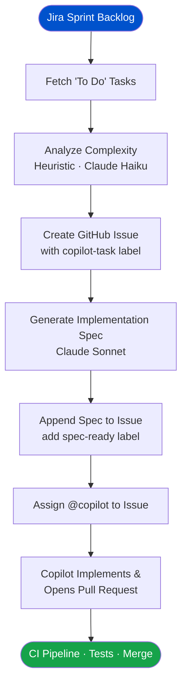

# copilot-dispatch

Autonomous pipeline that fetches tasks from a Jira sprint, analyzes complexity with AI, creates GitHub Issues, enriches them with implementation specs, and assigns GitHub Copilot.

Works with any Jira project and any GitHub repository. Configure via environment variables.

## What it does



Copilot then implements the task and opens a PR. Your CI pipeline in the target repo handles the rest.

## Setup

### 1. Clone and install

```bash
git clone <this-repo> && cd copilot-dispatch
npm install
cp .env.example .env
# Fill in .env
```

### 2. Configure `.env`

| Variable | Required | Description |
|---|---|---|
| `JIRA_BASE_URL` | ✅ | `https://yourteam.atlassian.net` |
| `JIRA_EMAIL` | ✅ | Your Atlassian account email |
| `JIRA_API_TOKEN` | ✅ | [Create here](https://id.atlassian.com/manage-profile/security/api-tokens) |
| `JIRA_PROJECT_KEY` | ✅ | e.g. `SCRUM` |
| `JIRA_SPRINT_PREFIX` | | Sprint name prefix to match (default: `Sprint`) |
| `JIRA_PICK_STATUSES` | | Comma-separated (default: `To Do`) |
| `JIRA_ASSIGNEE_FILTER` | | Jira account ID — leave blank for all |
| `JIRA_TRANSITION_TO` | | Transition matched issues to this status (default: `In Progress`) |
| `GITHUB_TOKEN` | ✅ | PAT with `repo` + `issues` scopes |
| `GITHUB_REPO` | ✅ | `owner/repo` |
| `ANTHROPIC_API_KEY` | ✅ | [Create here](https://console.anthropic.com/) |
| `TECH_STACK` | | Short description injected into the spec prompt |
| `ARCH_NOTES` | | Project-specific conventions for the spec prompt |
| `MAX_AUTO_TASKS` | | Max issues created per run (default: `3`) |
| `CONFIDENCE_THRESHOLD` | | Min confidence % to auto-create (default: `75`) |

### 3. Run locally

```bash
npm run dry        # preview — no Jira or GitHub changes
npm run analyze    # show analysis only
npm run pipeline   # full run
npm run enrich     # enrich a specific issue: add -- --issue 42
npm run poll-enrich  # enrich all pending copilot-task issues
```

For `enrich` with an issue number:

```bash
npx tsx src/cli.ts enrich --issue 42
```

### 4. GitHub Actions (automated)

The automation ships with two workflows in `.github/workflows/`:

| Workflow | Trigger | What it does |
|---|---|---|
| `jira-pipeline.yml` | Mon–Fri 09:00 UTC + manual | Fetches Jira, creates GitHub issues |
| `enrich-poll.yml` | Every 15 min + manual | Enriches pending issues, assigns Copilot |

**Secrets required** (Settings → Secrets → Actions in this automation repo):

```
JIRA_BASE_URL, JIRA_EMAIL, JIRA_API_TOKEN, JIRA_PROJECT_KEY
ANTHROPIC_API_KEY
COPILOT_DISPATCH_TOKEN   ← PAT with issues:write on the TARGET repo
```

**Variables required** (Settings → Variables → Actions):

```
GITHUB_REPO    ← target repo, e.g. "your-org/your-app"
TECH_STACK     ← e.g. "React + Express + PostgreSQL monorepo"
ARCH_NOTES     ← (optional) project conventions for the spec prompt
```

### 5. Event-driven enrichment (optional)

If you prefer immediate enrichment when a label is added (instead of polling every 15 min), copy `templates/workflows/copilot-enrich.yml` into your **target repo's** `.github/workflows/`. Then add:

- **Secret**: `COPILOT_DISPATCH_TOKEN` — PAT with `repo` access to this automation repo
- **Variable**: `COPILOT_DISPATCH_REPO` — `your-org/copilot-dispatch`

The template workflow checks out this repo at runtime and calls the enricher.

## Architecture

```
src/
  config.ts      — env var loader
  jira.ts        — Jira REST API client
  github.ts      — GitHub REST API client
  analyzer.ts    — complexity analysis (heuristic + Anthropic haiku)
  enricher.ts    — spec generation (Anthropic sonnet) + poll mode
  pipeline.ts    — main orchestrator
  cli.ts         — entry point

templates/
  workflows/
    copilot-enrich.yml   — copy to target repo for event-driven enrichment

.github/
  workflows/
    jira-pipeline.yml    — scheduled pipeline (runs in this repo)
    enrich-poll.yml      — scheduled enrichment poll (runs in this repo)
```

## Complexity analysis

The analyzer uses two engines:

- **Heuristic** (default): keyword/pattern matching, instant, no API cost
- **LLM** (`--llm` flag): Anthropic `claude-haiku-4-5`, more accurate on ambiguous tasks

Pass `--llm` to `npm run pipeline` or set `use_llm: true` in the workflow dispatch input.

## Processed-issues tracker

`.processed-issues.json` records every Jira key that has been turned into a GitHub issue, preventing duplicates on subsequent runs. In GitHub Actions this file is uploaded as an artifact after each pipeline run (90-day retention). For persistent state across runs, download the artifact and commit it, or use a lightweight store.
